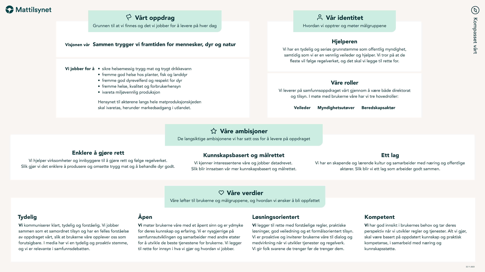

# Kompasset og roller

## Kompasset

### Bakgrunn
Mattilsynet er i endring og brukerne våre trenger å forstå hvor vi er på vei. For å bli oppfattet som tydelige og enhetlige, må det synes at vi alle jobber for de samme overordnede målene. Dette kompasset skal bidra til å samle oss, sette ord på hvem vi er og hva som er vår strategiske retning. Slik kan det bli et verktøy i arbeidshverdagen, enten vi utvikler nye nettsider eller rekrutterer nye kolleger.

### Mål
Ambisjonen er at kompasset brukes i arbeidshverdagen, inn i alle aktiviteter og initiativer som en påminnelse om våre overordnede mål og planer for fremtiden, fordi det vil gi brukerne det etterlatte inntrykket vi ønsker at de skal ha av oss. Kompasset skal være lett å huske, og også egnet til å reflektere rundt, når vi står overfor litt større valg der vi spør oss: er dette vår rolle? Er dette i tråd med våre verdier? Er dette riktig retning? Da skal vi finne svar i kompasset. Målet er todelt: å bli oppfattet som mer tydelige og enhetlige av brukerne våre på tvers av alle flater, og at det blir enklere å samarbeide på tvers av team og fagområder internt. Får vi til det, vil vi jobbe mer effektivt med å oppnå våre overordnede mål for Mattilsynet.

### Identiteten hjelperen
Vi snakker om vår visuelle identitet og ikke vår profil da dette innebærer mer enn bare det visuelle. Dette handler om hvordan vi snakker, skriver, opptrer og ser ut. Hva ønsker vi at brukerne skal huske oss som? Vi er en hjelper, vi har en tydelig og seriøs grunnstemme som offentlig myndighet, samtidig som vi er en vennlig veileder og hjelper. Vi tror på at de fleste vil følge regelverket, og det skal vi legge til rette for. 

### Kontaktpersoner
Mattilsynets visuelle identitet forvaltes av interne ressurser.
 Kontakt: [internpost.digitale.kanaler@mattilsynet.no](mailto:internpost.digitale.kanaler@mattilsynet.no)

## Våre roller

Vår visuelle identitet skal fungere for oss i våre ulike roller og gjenspeiler personligheten vår:
"Vi har en tydelig og seriøs grunnstemme som offentlig myndighet, samtidig som vi er en vennlig veileder og hjelper. Vi tror på at de fleste vil følge regelverket, og det skal vi legge til rette for."

Vi må visuelt kommunisere på litt ulike måter i våre ulike roller og identiteten vår favner dette - slik at vi samtidig klarer å beholde det samlede, helhetlige uttrykket.

[GRAFIKK]

### Myndighetsutøver

Ved å være rettferdige, konstruktive og tydelige hjelper vi folk å gjøre rett, nå og i framtiden. Vi skal tydelig kommunisere hvorfor vi bruker sanksjoner. Ved å være strenge og myndige når det er behov for det, sikrer vi samfunnsmålene på våre områder. 

Som direktorat
- Utvikler, påvirker og avklarer regelverk 
- Behandler klager på vedtak gjort av tilsynet

Som tilsyn
- Følger opp når noen ikke følger reglene
- Håndhever regelverket ved hjelp av sanksjoner
- Utøver skjønn og vurderer hvordan det følges opp når regelverksbrudd er konstatert

[GRAFIKK]

### Veileder

Veiledning og kunnskap skaper trygghet, og vi skal motivere til å gjøre rett. Vi møter brukerne med tillit og tror på at de fleste vil følge reglene. Vi kan veilede, men det er virksomhetene selv som har ansvar for å følge reglene.

Som direktorat
- Lager veiledere for å gjøre det enklere å forstå reglene
- Veileder regionene og næringen

Som tilsyn
- Veileder om regelverket når vi er ute på tilsyn, slik at det blir enklere for tilsynsobjekter å følge det

### Beredskapsaktør

Vi jobber for å forebygge hendelser og håndterer hendelser når de inntreffer. Beredskap er en rolle som går på tvers av alle oppgavene våre. 

Som direktorat
- Utvikler, påvirker, avklarer og veileder om relevant regelverk 
- Jobber med beredskapsplanlegging
- Håndterer nasjonale hendelser

Som tilsyn
- Veileder og håndhever når en hendelse inntreffer 
- Forebygger gjennom tilsyn for å minske risikoen for nye hendelser
- Håndterer regionale hendelser

[GRAFIKK]
